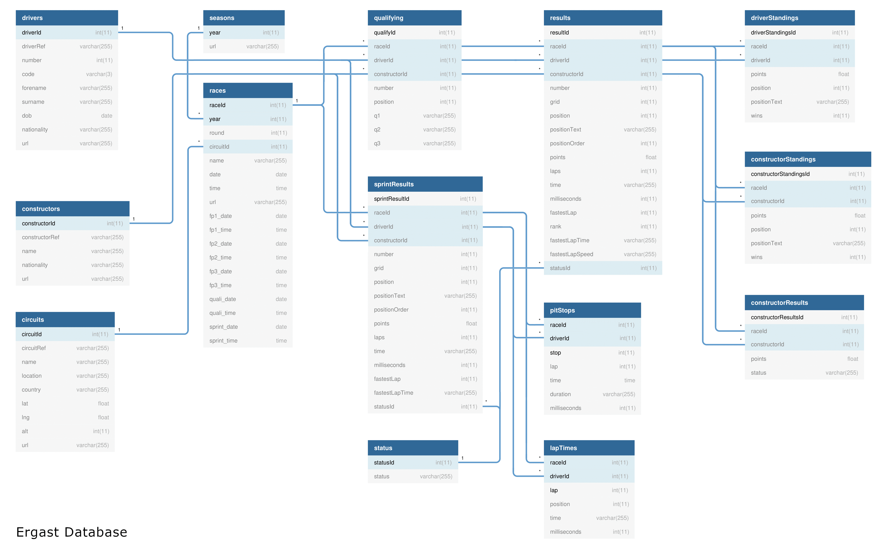

# Formula 1 Racing Data Pipeline: End-to-End Data Engineering with Azure Databricks & Data Factory

# Introduction

An end-to-end data engineering project that creates a fully monitored pipeline using Medallion Architecture to transform and store data in Azure Data Blobs, from raw to processed to presentation formats. Built with Azure Databricks Notebooks for ingestion, processing, and transformation, and orchestrated by Azure Data Factory, the pipeline ensures data quality and compliance.

Leveraging scalable cloud technologies, efficient formats like Parquet and Delta Lake, and robust tools for orchestration and visualization, it delivers a reliable and efficient pipeline to support operational and reporting needs.

# Project Requirement

## Data Ingestion Requirements
    * Ingest all files into the Data Lake.
    * Ingested data must have the schema applied.
    * Ingested data must have audit columns.
    * Ingested data must be stored in columnar format (i.e., Parquet).
    * Must be able to analyze the ingested data via SQL.
    * Ingestion logic must be able to handle incremental load.

## Data Transformation Requirements
    * Join the key information required for reporting to create a new table.
    * Join the key information required for analysis to create a new table.
    * Transformed tables must have audit columns.
    * Must be able to analyze the transformed data via SQL.
    * Transformed data must be stored in columnar format (i.e., Parquet).
    * Transformation logic must be able to handle incremental load.

## Reporting Requirements
    * Driver Standings
    * Constructor Standings

## Analysis Requirements
    * Dominant Drivers
    * Dominant Teams
    * Visualize the outputs
    * Create Databricks Dashboards

## Non Functional Requirements
    * Schedule to run every Sunday 10PM.
    * Ability to monitor the pipelines.
    * Ability to re-run fialed pipelines.
    * Ability to set-up alerts on failures.

## Other Non-Functional Requirements
    * Ability to delete individual records (To satisfy user privacy laws such as GDPR).
    * Ability to see history and time travel.
    * Ability to roll back to previous version.

# Formula1 Data Source & Data Overview

<b> Entity Relation Diagram:</b>

More info about dataset can be found here:
1. Current 3rd Party Developer API:  https://ergast.com/mrd/
2. Proposed Successor can be used as a drop-in replacement: https://github.com/jolpica/jolpica-f1

# Architecture

The solution utilizes Medallion Architecture as it provides a structured, multi-layered approach to progressively improving the quality and reliability of data. By organizing data into distinct layers, it enables incremental improvements in accuracy, making the data more suitable for business intelligence and machine learning applications.

These architectural solution is heavily based on this Microsoft documentation: https://learn.microsoft.com/en-us/azure/architecture/solution-ideas/articles/azure-databricks-modern-analytics-architecture

## Ingestion

    1. Data is ingested through a Databricks Notebook from the Ergast website via a full load (Historical Data) and an incremental load (Weekly Data).
    2. The data is stored in an ADLS container named 'processed'.
    3. Data in this layer will have the schema applied and be stored in a columnar format.
    4. Partitions will be applied where applicable.
    5. Additional information for audit purposes, such as the ingestion date and data source, will be included.
    6. Initially, this data will be stored in Parquet format.
    7. The data will later be converted to Delta Lake to meet GDPR requirements and enable time travel.

## Tranformation

    1. Processed data will then be transformed using a Databricks Notebook.
    2. The results will be stored in another ADLS container named 'Presentation.'
    3. Similar to the ingested data, the transformed data will initially be in Parquet format.
    4. The data will later be converted into Delta Lake.

## Load

    1. These notebooks will use data from both the processed and presentation containers.
    2. We then use Databricks notebooks to analyze and load the data to created dashboards to satisfy our analysis requirements.

# Technology Used

1. Azure Databricks
2. Azure Data Factory
3. Azure Data blobs
4. Apache Spark
5. Delta Lake
6. Azure Key Vault
7. Power BI

# Reporting and Analysis

# Credits

